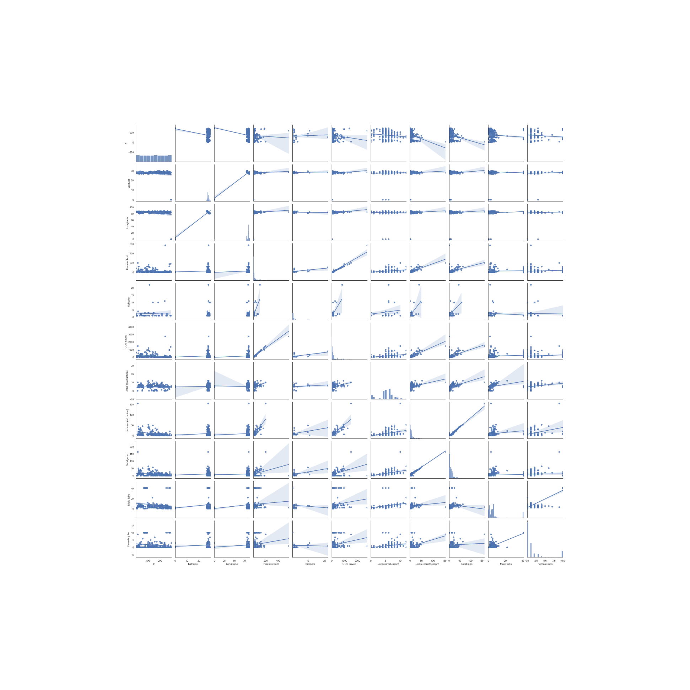
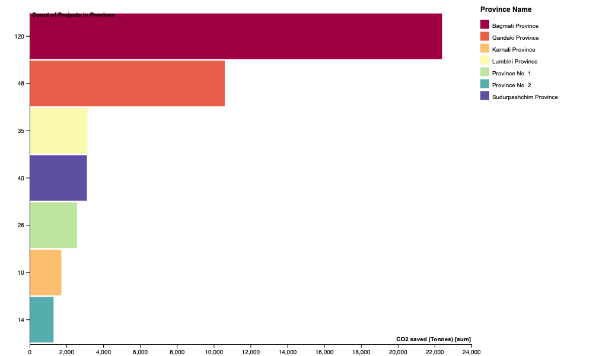

# Build up Nepal

The goal of this project is to analyze the data provided by **Build Up Nepal** to enable them communicate their impact to *stakeholders, communities and the government* in Nepal.
The visualization would also serve to start the conversation about safe, hygenic housing in rural areas and the importance of defining the last mile infrastructure in development planning.

The important metrics they would like to highlight include:

- Jobs created
- Houses built
- Number of enterprises established and sustaining long-term
- Tonnes of CO2 emissions saved

## Progress

- [X] Basic exploration using LibreOffice
- [X] Identified the questions I would like to answer based on the initial exploration:

  1. Tonnes of CO2 emissions saved
  2. Number of jobs created in each region
  3. How long on average do projects last?
  4. Is there a relationship between job and gender?
  5. In what region are projects most abandonned? Completed?
- [X] Examine relationships between variables by making large plots to easily spot trends.
  
- [X] Start exploring the questions.

  ### How many Tonnes of CO2 were saved?

  1. Create a pivot table for district, province and CO2 emission.
     Findings:
     - The projects were able to span over **293** districts and **44854.24** Tonnes of CO2 saved.
     - Gorkha district in Gandaki Province had **18** projects and saved **5570.8974** tonnes of CO2.
     - | Province Name          | Count of Projects in Province | CO2 saved (Tonnes) |
       | ---------------------- | ----------------------------- | ------------------ |
       | Bagmati Province       | 120                           | 22403.517          |
       | Gandaki Province       | 48                            | 10599.1824         |
       | Karnali Province       | 10                            | 1724.07            |
       | Lumbini Province       | 35                            | 3139.383           |
       | Province No. 1         | 26                            | 2575.5             |
       | Province No. 2         | 14                            | 1299.264           |
       | Sudurpashchim Province | 40                            | 3113.325           |
  2. Visualize
     

  ### How many jobs were created?

  1. Create a pivot table for Districts, total jobs, male jobs and female jobs.
     Findings:
     - The projects were the source of **5617** jobs. *2926* in production or construction,  *2218* male jobs and *473* female jobs.
     - Bagmati Province created the highest number of jobs **2464**; of which *1023* were in construction or production, *1168* were male jobs and *273* were female jobs.
     - | Province Name          | Production and Construction jobs | Male jobs | Female jobs | Total Number of jobs |
       | ---------------------- | -------------------------------- | --------- | ----------- | -------------------- |
       | Bagmati Province       | 1023                             | 1168      | 273         | 2464                 |
       | Gandaki Province       | 482                              | 385       | 91          | 958                  |
       | Karnali Province       | 176                              | 85        | 17          | 278                  |
       | Lumbini Province       | 446                              | 166       | 26          | 638                  |
       | Province No. 1         | 242                              | 105       | 17          | 364                  |
       | Province No. 2         | 132                              | 96        | 19          | 247                  |
       | Sudurpashchim Province | 425                              | 213       | 30          | 668                  |
  2. Visualize
     

  ### Whats the average duration of Projects?

  1. Make a summary table of the average duration of projects in each province.
     - Found out the total average duration of projects is *176* months.
     - Bagmati Province had the maximum average duration of projects, a value of *291.7* months.

  - | Province Name          | Average Duration |
    | ---------------------- | ---------------- |
    | Bagmati Province       | 291.75           |
    | Gandaki Province       | 257.875          |
    | Karnali Province       | 156.3            |
    | Lumbini Province       | 9.2857           |
    | Province No. 1         | 15.153           |
    | Province No. 2         | 9.214            |
    | Sudurpashchim Province | 44.35            |

  2. Visualize
     

  ### Is there a relationship between jobs and gender?

  1. Encode gender to binary. Make a summary table of total number of jobs and gender. A number higher than 0 shows there were female jobs in the province.
    - Found out *Province No. 2* and *Sudurpashchim Province* didn't hire female workers.
    - | Province Name | Total Jobs | Gender-BINARY |
      | ---- | ---- | ---- |
      | Bagmati Province |	3532 |	2|
      | Gandaki Province |	1452 |	4|
      | Karnali Province |	454	 |1|
      | Lumbini Province |	1099 |	4|
      | Province No. 1 |	612 |	2 |
      | Province No. 2 |	381 |	0 |
      | Sudurpashchim Province | 1121 | 0|
    - There is a positive correlation of *.10* between Total jobs and Gender which i deem statistically significant.

  ### What are the Projects Status?
  1. Make a pivot table of Province and count of projects, setting status as a filter.
    - *293* projects in total,  
    - *16* closed or sold projects
    - *20* struggling projects
    - *6* recently started projects
    - *189* struggling projects

- [X] Interesting findings

  1. 
  2. The province with the highest number of jobs didn't save the highest amount of CO2 as I thought would happen.
  3. Found out a total od *124* schools were built, *6018* houses were built over a duration of **51574** months.
  4. Bagmati Province built *2910* houses and *38* schools over *35011* months.

## Tools used
1. LibreOffice
2. Pen/Paper
3. Git
4. RawGraphs.io
5. Tableau
